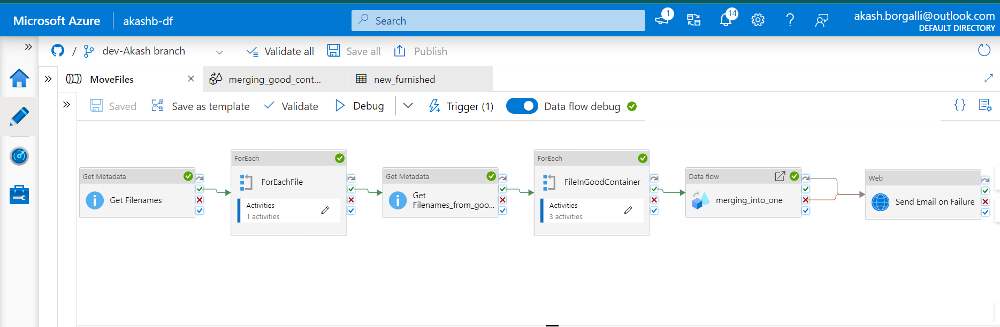
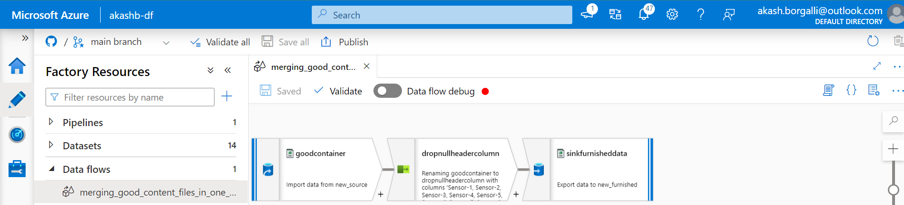
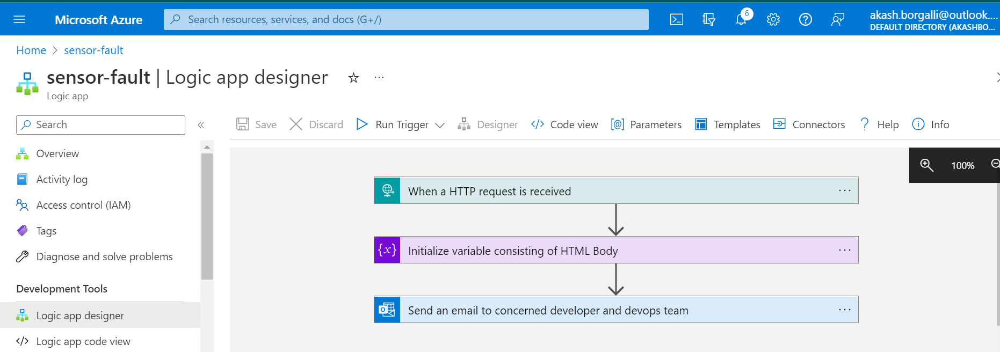
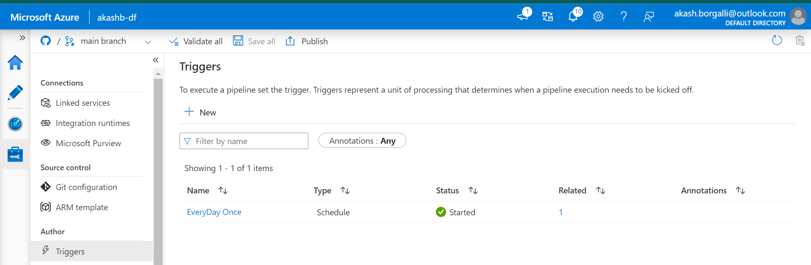

# Sensor-Fault-Detection-using-Azure-Data-Factory

🚩 ***Business Requirement***: \
To create a data validation pipeline based on Data Sharing Agreement(DSA) using azure datafactory for multiple sets of CSV files consisting of different sensor data coming from IoT devices which are placed at remote locations and moving them into appropriate azure blob containers for further processing followed by merging the valid content of files so data scientists can use that file for model building.

## ⚙️ Data Validations and Preprocessing steps:
Steps : 1. Validating filenames by their length(25) and which starts from a specific character(wafer).\
2. Columns present in a particular csv file (592).\
3. Dropping column which has no header.\
4. Merging the appropriate files into one csv file.\
5. Repeat everyday once

## 💻 Tech Stack

**Cloud Platform:**  Azure 
**Cloud ETL Tool:**  Azure Data Factory 

## 💡 Screenshots:
- **Authoring Pipeline**\

- **DataFlows**

- **Logic Apps for sending email alert if pipeline fails**

- **Trigger: Schedule**

## Author 

- [@Akash Borgalli](https://www.linkedin.com/in/akashborgalli/)

